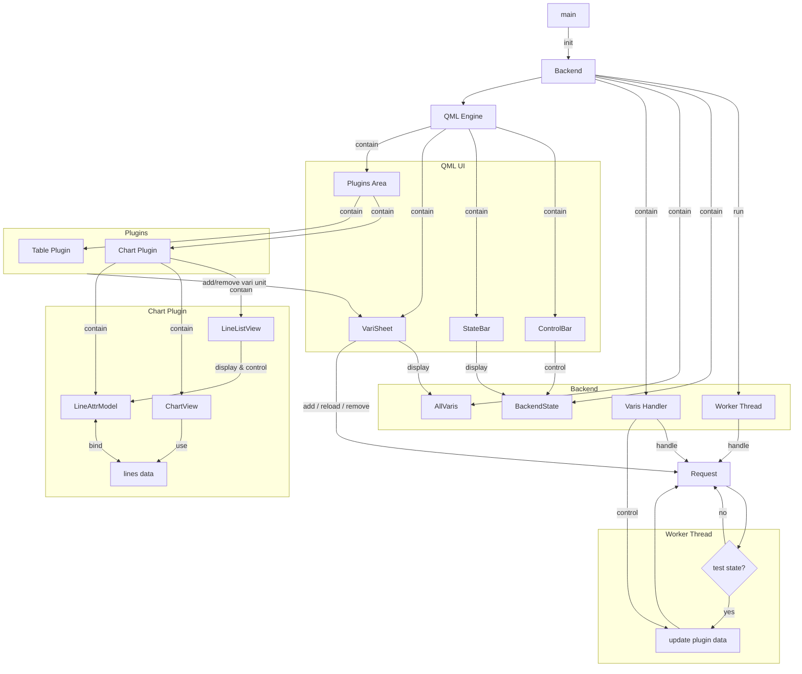

```mermaid
flowchart TD
    %% 主入口
    Main[main] -->|init| Backend[Backend]

    %% Backend 核心组件
    subgraph Backend_Core [Backend]
        BackendState[BackendState]
        AllVaris[AllVaris]
        Worker[Worker Thread]
        VarisHandler[Varis Handler]
    end

    Backend -->|run| Worker
    Backend -->|contain| BackendState
    Backend -->|contain| AllVaris
    Backend -->|contain| VarisHandler

    %% QML UI 部分
    subgraph QML_UI [QML UI]
        ControlBar[ControlBar]
        StateBar[StateBar]
        VariSheet[VariSheet]
        PluginsArea[Plugins Area]
    end

    Backend --> QML[QML Engine]
    QML -->|contain| ControlBar
    QML -->|contain| StateBar
    QML -->|contain| VariSheet
    QML -->|contain| PluginsArea

    %% UI 与 BackendState 交互
    StateBar -->|display| BackendState
    ControlBar -->|control| BackendState

    %% Plugins 部分
    subgraph Plugins [Plugins]
        Chart[Chart Plugin]
        Table[Table Plugin]
    end

    PluginsArea -->|contain| Chart
    PluginsArea -->|contain| Table

    %% Chart 内部
    subgraph Chart_Sub [Chart Plugin]
        LineListView[LineListView]
        ChartView[ChartView]
        LineAttrModel[LineAttrModel]
        Lines[lines data]
    end

    Chart -->|contain| LineListView
    Chart -->|contain| ChartView
    Chart -->|contain| LineAttrModel
    ChartView -->|use| Lines

    LineAttrModel <-->|bind| Lines
    LineListView -->|display & control| LineAttrModel

    %% VariSheet 交互
    VariSheet -->|display| AllVaris
    Plugins -->|add/remove vari unit| VariSheet
    VariSheet -->|add / reload / remove| Request[Request]

    %% Worker 请求处理循环
    Worker -->|handle| Request

    subgraph WorkerCore [Worker Thread]
        direction TB
        Test{test state?}
        Update[update plugin data]
    end

    Request --> Test
    Test -->|no| Request
    Test -->|yes| Update
    Update --> Request

    VarisHandler -->|handle| Request
    VarisHandler -->|control| Update
```

